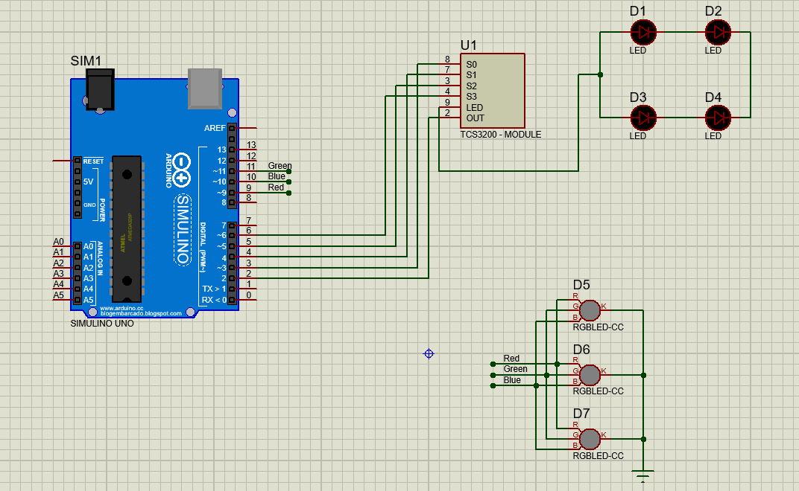

# Project_CE224.L21.MTCL

## Tool
Arduino IDE: https://www.arduino.cc/en/software

Or

PlatformIO IDE on VSCode: https://code.visualstudio.com/

## Device

1. Arduino Uno R3
2. Color sensor TCS3200
3. Led RGB
4. ...

## Color 

|    Red   |    Green    |    Blue    |    Color    |
|----------|-------------|------------|-------------|
|    255   |      0      |      0     |    Red      |
|     0    |     255     |      0     |    Green    |
|     0    |      0      |     255    |    Blue     |
|    255   |     255     |      0     |    Yellow   |
|     0    |     255     |     255    |Blueish Green|
|    255   |      0      |     255    |    Purple   |
|    255   |     255     |     255    |    White    |

## Schematic 

